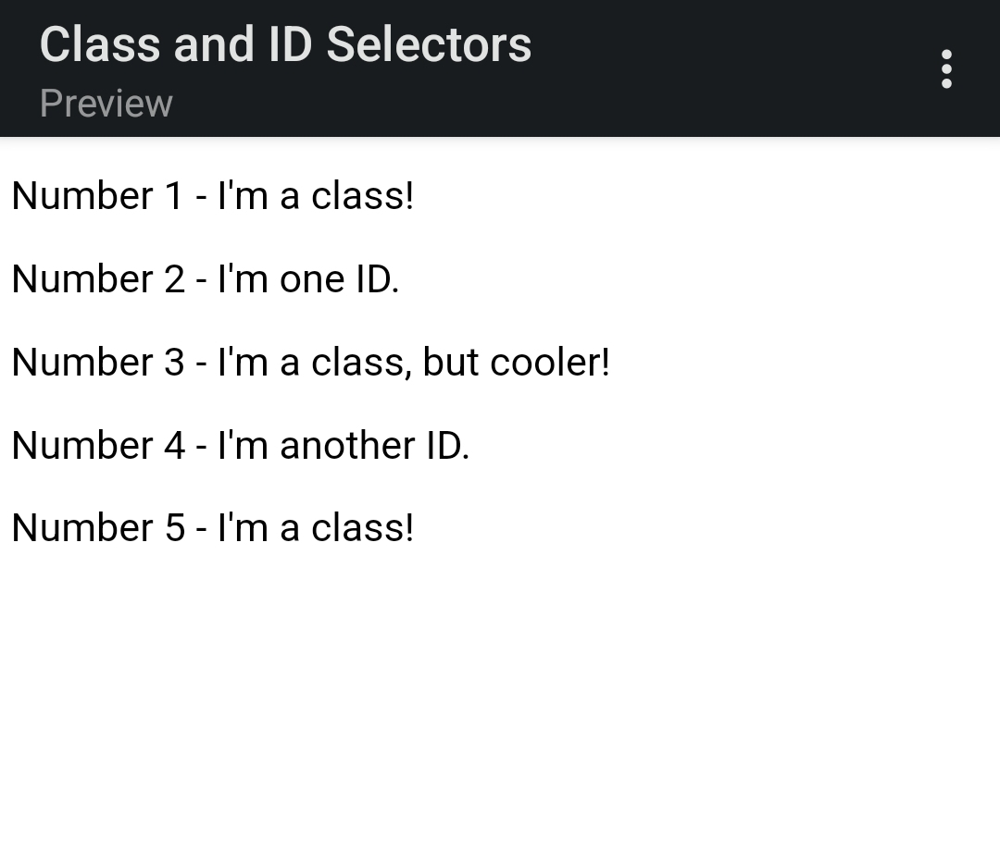

# Class and ID Selectors
In this project, I've shown how to add class and ID attributes to HTML elements, as well as use their respective selectors.

I have then added rules in the CSS file using the correct selector syntax, keeping in mind which elements look similarly styled (classes), which ones may be completely unique from the rest (ID), and which ones have slight variations from others (multiple classes).

For the colors in this exercise, I've used non-keyword values (RGB, HEX, or HSL). The properties I have added to each element are:

* **All odd numbered elements**: a light red/pink background, and a list of fonts containing `Verdana` and `DejaVu Sans` with `sans-serif` as a fallback
* **The second element**: blue text and a font size of 36px
* **The third element**: in addition to the styles for all odd numbered elements, added a font size of 24px
* **The fourth element**: a green background, a font size of 24px, and bold

## Initial

## Desired Outcome

